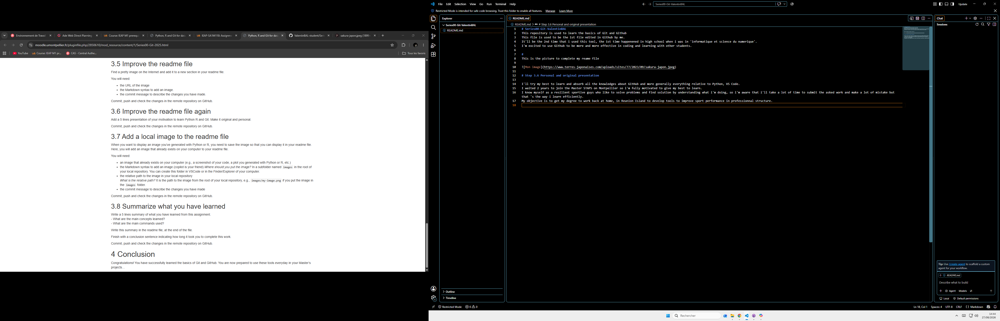

# Series00-Git-ValentinBAL
This repository is used to learn the basics of Git and Github
This file is used to be the 1st file edited in Github by me.
It'll be the 2nd time that i used this tool, the 1st time happenened in high school when i was in 'informatique et science du numerique'.
I'm excited to use Github to be more and more effective in coding and learning with other students.  

#
This is the picture to complete my reame file 

# Step 3.6 Personal and original presentation

I'll try my best to learn and absorb all the knowledges about GitHub and more generally everything relative to Python, VS Code.
I waited 2 years to join the Master STAPS on Montpellier so i'm fully motivated to give my best to learn. 
I know myself as a resilient sportive guys who like to solve problems and find solution by understanding what i'm doing, so i'm aware that i'll take a lot of time to submit the asked work and make a lot of mistake but that 's the way i learn efficiently.
My objective is to get my degree to work back at home, in Reunion Island to develop tools to improve sport performance in professionnal structure.

# Add of a local image in the readme file

This is a screenshot of my screens, beacause i'm doing with my desktop computer, (don't worry, i won't bring 2 screens in classes :))

